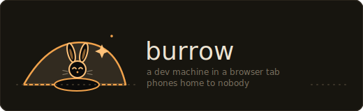

<div align="center">



**A whole dev machine in a browser tab.** Real Bun, real git, a real shell, a live server preview, and a local AI coding agent — all running on your own machine, inside the page. No backend, no remote sandbox, nothing leaves the tab.

An open-source, Bun-native alternative to WebContainers.

### [**Try it live → burrow.page**](https://burrow.page)

Open it, type `bun run index.ts`, watch a server come up.<br>
Then ask the agent panel to *"create a Bun HTTP server in src/server.ts and run it"* — a model on **your** GPU edits the files and runs the commands, in the tab.

</div>

---

## The trick

You can't compile Bun to WebAssembly and run it in a browser — Bun is Zig on JavaScriptCore, and JSC-in-WASM isn't practical. So Burrow does what WebContainers does: **run JavaScript on the browser's own engine, and virtualize everything around it.** The pieces that make that feel like a real machine:

- **`bun.wasm`** — Bun's actual Rust transpiler, compiled to WebAssembly and driven through a hand-written WASI shim. Your `.ts`/`.tsx`/`.jsx` is transpiled with genuine Bun semantics, not a reimplementation.
- **A virtual filesystem** that everything shares — the editor, the shell, git, the package manager, and the runtime all read and write the same in-memory tree, which is snapshotted to IndexedDB so your workspace survives a reload.
- **Web Workers as processes** — each `bun run` boots a dedicated module worker from a generated bootstrap; the code executes on the host engine.
- **A service worker as the network** — `Bun.serve()` inside a worker is bridged back out to a real, fetchable URL in the page, so you can open your server in an iframe (or a new tab) and hit its routes.

Everything is client-side. The only network calls Burrow itself makes are a CORS proxy for `git clone` and the npm registry for `bun install` — both are plain same-origin passthroughs you can see in `server.ts`.

## What you get

| | |
|---|---|
| **Terminal** | Interactive bash (via [just-bash](https://www.npmjs.com/package/just-bash)) — history, tab-completion, `Ctrl+C`/`A`/`E`/`U`/`W`/`L`, pipes, globs, `cd`/`export` that persist. |
| **Editor** | CodeMirror 6, file tree with full create/rename/delete, per-file debounced autosave, a live git diff panel. |
| **Runtime** | `bun run file.ts` — real transpile → module graph → worker execution, with streamed stdout/console. |
| **Server preview** | `Bun.serve()` and Hono apps served live into an iframe with graceful hot reload, and **per-port routing** (`/preview/<port>/`) so multiple servers coexist. |
| **Packages** | `bun install` / `add` / `remove` that fetch, unpack and hoist real tarballs from npm into `node_modules`, with an offline-replayable lockfile. |
| **git** | `clone` (shallow, over a CORS proxy), `init`, `status`, `add`, `commit`, `log`, `branch`, `diff`, `checkout -- <paths>` via [isomorphic-git](https://isomorphic-git.org). |
| **AI agent** | A Cursor-style coding agent driving a small **local** model (Qwen3-0.6B, or Gemma) on WebGPU via [transformers.js](https://github.com/huggingface/transformers.js) — it reads, edits, and creates files and runs shell commands in a loop. Weights download once; inference is on-device. |

## Quickstart

Requires [Bun](https://bun.com) ≥ 1.3.

```bash
bun install
bun run dev          # dev server with HMR
# open http://localhost:4808
```

```bash
bun test             # run the suite (~340 tests)
bun run build        # static bundle into dist/
```

## How it works

### The filesystem

`src/vfs` is the spine. just-bash's `InMemoryFs` is the canonical store (POSIX-ish: modes, symlinks, mtimes); a `WatchedFs` decorator wraps every mutation and emits `file:changed` on a typed event bus, which is how the editor, file tree, diff panel and the runtime's hot-reload watcher all stay in sync without knowing about each other. A `GitFsAdapter` re-exposes the same tree through the exact promise-fs surface isomorphic-git expects. Persistence is a debounced full-snapshot into IndexedDB with restore-before-seed on boot and a corrupt-snapshot fallback that reseeds cleanly.

### Running code

`bun run <entry>` (in `src/toolchain`):

1. **Transpile.** `bun.wasm` (module-level singleton, lazily instantiated behind a WASI shim) transpiles each source file.
2. **Build the graph.** Import specifiers are extracted and rewritten: relative imports resolve against the VFS, bare imports resolve Node-style through `node_modules`, and anything uninstalled falls back to `https://esm.sh`. CommonJS gets a facade; ~40 `node:*` builtins get shims. Each module becomes a blob URL.
3. **Execute.** A generated bootstrap module is booted in a dedicated `Worker`. It pipes `console.*` and uncaught errors back to the host, installs the `Bun.serve` shim, imports the entry blob, and inspects the default export (a `{ fetch }` object / Hono instance / bare handler all register like `Bun.serve`).

### Serving a server

A worker has no network, so `Bun.serve()` is captured by the bootstrap shim and its port reported to the host. `public/sw.js` intercepts same-origin `/preview/<port>/*` requests, forwards each (method, headers, body intact) to the controlling page over a `MessageChannel`, the page hands it to the matching run session's fetch handler, and the serialized response is turned back into a real `Response`. Bare `/preview/*` targets the most-recently-started server. Hot reload rebuilds the graph in a *pending* worker that keeps the old one serving until the replacement confirms it's listening, then promotes it — so a broken edit never drops your running server.

### The shell

`src/shell` mounts a [WTerm](https://www.npmjs.com/package/@wterm/dom) widget and drives it with a custom line editor (`driver.ts`) — history, tab completion, keybindings, `Ctrl+C` interrupt via an `AbortController` per command. One `Bash` instance runs for the app's lifetime; because just-bash resets shell state per `exec`, the driver threads `{cwd, env}` through manually and serializes every keystroke and command so async work (tab completion, a running command) never scrambles the line state.

### Packages

`src/npm` is a from-scratch browser package manager: it resolves a dependency graph against abbreviated npm packuments, downloads and gunzips tarballs, parses them with a hand-rolled `ustar` reader, and lays out a flat-hoisted `node_modules` in the VFS. A `burrow-lock.json` lockfile lets a fully-locked install replay with zero registry fetches.

### The AI agent

`src/ai` runs a small model entirely in-browser (transformers.js + onnxruntime-web, bundled into a same-origin module worker, WebGPU). Inference stays in the worker; the **agent harness** runs on the main thread, where it has registry access to the VFS and shell. It drives the model in a tool-use loop — read/list/write/edit files, run shell commands — parsing a lenient text protocol tuned to survive small-model output, executing one tool per step, feeding the result back, and streaming each step into the panel. You can `@`-mention files to pull them into context, and every action is visible and interruptible.

### Wiring

The nine modules never import each other directly. They talk through a typed service-locator registry (`src/contract`): each module `provide`s its API under a key and `use`s others' by key, and shell commands register into one table. Boot order and ownership are pinned in [CONTRACT.md](./CONTRACT.md).

## Compatibility

Burrow is young and honest about its gaps — no raw TCP (so Postgres/Redis clients need a relay), no native addons, `Bun.serve` `fetch` handlers only (not `routes`/`websocket` yet), no `git push`/`pull`, no npm lifecycle scripts. The full support matrix — shell builtins, Bun APIs, `node:*` shims, the package manager, the networking model — is in **[COMPAT.md](./COMPAT.md)**.

## vs WebContainers

Same core bet — keep execution on the host JS engine, virtualize the OS around it. The differences: Burrow is **Bun-native** (and uses Bun's *real* transpiler rather than reimplementing one), it's **MIT** rather than a proprietary commercial license, and it ships a **local AI coding agent** in the box. It's also far less complete: WebContainers emulates a real Node.js runtime with process and socket layers built over years; Burrow is an early project with a documented compatibility surface and plenty of gaps.

## Project layout

```
src/
  contract/   typed service registry + the cross-module type contract
  vfs/        InMemoryFs + WatchedFs + event bus + IndexedDB persistence
  git/        isomorphic-git over the fs adapter, the `git` command, diff renderer
  toolchain/  bun.wasm loader, module graph, worker runtime, sw preview bridge
  npm/        registry client, tarball extract, node_modules layout, lockfile
  shell/      WTerm mount + line-editor/exec driver
  ai/         local-model worker + agentic coding harness + panel UI
  ui/         the IDE shell — layout, editor, file tree, diff, console, preview
public/sw.js  the preview service worker
server.ts     dev server (HTML import, git proxy, static routes)
build.ts      static production bundle
```

Deeper design notes: **[docs/ARCHITECTURE.md](./docs/ARCHITECTURE.md)**.

## Contributing

PRs welcome — see **[CONTRIBUTING.md](./CONTRIBUTING.md)**. The one rule that keeps the codebase sane: modules talk only through `src/contract`, never by importing each other directly. Keep `bun test` green.

## License

MIT © 2026 Dhravya Shah — see [LICENSE](./LICENSE).
